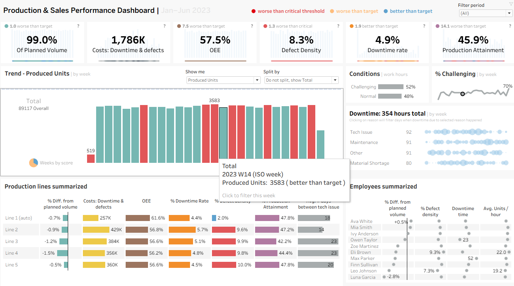

# Project Manufacture: Production Dashboard

An interactive **Tableau manufacturing analytics dashboard** designed to monitor production performance, operational efficiency, quality, downtime, workforce performance, and the financial impact of production losses.

The dashboard provides plant managers and operations teams with a centralized view of:

* Production output vs. target
* Overall Equipment Effectiveness (OEE)
* Defect density and First Pass Yield
* Downtime and downtime reasons
* Production attainment
* Working conditions
* Employee performance
* Downtime and defect costs
* Net profit impact

---

## Dashboard Preview



---

## Table of Contents

* [Overview](#overview)
* [Business Questions](#business-questions)
* [Dashboard Layout](#dashboard-layout)
* [Interactivity](#interactivity)
* [Data](#data)
* [KPI Definitions](#kpi-definitions)
* [Targets and Thresholds](#targets-and-thresholds)
* [Cost and Profit Model](#cost-and-profit-model)
* [Tools and Technologies](#tools-and-technologies)
* [Getting Started](#getting-started)
* [Repository Structure](#repository-structure)
* [Notes](#notes)
* [Author](#author)

---

## Overview

Manufacturing managers need to quickly understand whether production is meeting plan, where operational losses are occurring, and how those losses affect profitability.

The **Project Manufacture: Production Dashboard** was developed in Tableau to provide an interactive view of manufacturing operations across production lines.

The dashboard focuses on three core business questions:

### 1. How are we performing?

The dashboard provides KPI cards for:

* Production Volume
* Production vs. Target
* OEE
* Defect Density
* Downtime Rate
* Production Attainment

Each KPI can be evaluated against configurable targets and critical thresholds.

### 2. Where are the problems occurring?

Performance can be analyzed across:

* Production lines
* Automated vs. manual production
* Working conditions
* Downtime reasons
* Employees
* Weekly production trends

### 3. What is the financial impact?

The dashboard converts downtime and defective production into estimated financial costs using configurable parameters.

This allows users to understand how operational inefficiencies translate into financial losses.

---

# Business Questions

The dashboard was designed to answer the following business questions:

### Production Performance

* Are production lines meeting their planned output?
* Which production lines are performing above or below target?
* How does production change over time?
* What is the production attainment rate?

### Operational Efficiency

* What is the current OEE?
* What are the main contributors to efficiency losses?
* How does performance vary between automated and manual lines?
* What is the downtime rate?

### Quality

* What percentage of production is defective?
* What is the First Pass Yield?
* Which production lines experience higher defect rates?

### Downtime

* How many hours are lost to downtime?
* What are the main downtime reasons?
* Which weeks experience the highest downtime?
* Which production lines are most affected?

### Workforce and Conditions

* How does employee performance vary?
* How do working conditions affect production?
* What percentage of working hours occur under challenging conditions?

### Financial Impact

* How much does downtime cost?
* How much is lost because of defective units?
* What is the estimated net profit?
* How do operational losses affect profitability?

---

# Dashboard Layout

The Tableau dashboard uses a fixed-size **1366 × 768** canvas containing 12 worksheets.

| Dashboard Area         | Worksheet(s)                                                                                                       | Purpose                                                     |
| ---------------------- | ------------------------------------------------------------------------------------------------------------------ | ----------------------------------------------------------- |
| **KPI Strip**          | Production Volume KPI, Production Costs, OEE KPI, Defect Density KPI, Downtime Rate KPI, Production Attainment KPI | Provides an executive summary of key manufacturing metrics  |
| **Trend Hub**          | Trend Hub                                                                                                          | Shows weekly trends for the selected metric                 |
| **Line Comparison**    | Line Comparison                                                                                                    | Compares production lines across key performance indicators |
| **Working Conditions** | Work Conditions Summary, Challenging Condition Trend                                                               | Shows working-condition distribution and trends             |
| **Downtime**           | Downtime Reasons                                                                                                   | Shows downtime hours by reason and week                     |
| **People**             | Employee                                                                                                           | Provides employee-level performance analysis                |

---

# Interactivity

The dashboard is designed as an interactive analytical tool rather than a static report.

## Trend Hub Controls

### Show What

Users can change the metric displayed in the trend analysis.

Available options include:

* Produced vs. Target
* Produced Units
* Costs: Downtime & Defects
* OEE %
* Defect Density %
* Downtime Hours
* Production Attainment %
* Downtime Rate %

### Split

The selected metric can be analyzed by:

* Production Line
* Automated vs. Manual Line
* Working Conditions
* Total

---

## Filter and Highlight Actions

| Interaction           | Trigger                            |
| --------------------- | ---------------------------------- |
| **Date Filter**       | Select month/year                  |
| **KPI Weeks**         | Select weeks from KPI cards        |
| **Production Line**   | Select a line from Line Comparison |
| **Downtime Reason**   | Select a downtime reason           |
| **Working Condition** | Select a working condition         |
| **Employee**          | Select an employee                 |

Selections are connected across the dashboard so users can drill into specific operational issues.

---

# Data

## Data Source

The dashboard uses an Excel workbook named:

`Production_Data.xlsx`

The primary worksheet is:

`Data`

The dataset contains one record per production line per day.

> **Note:** The source data is not bundled with the Tableau workbook. See [Getting Started](#getting-started).

## Data Dictionary

| Field                    | Type    | Description                                        |
| ------------------------ | ------- | -------------------------------------------------- |
| `Production Line`        | String  | Production line identifier                         |
| `Date`                   | Date    | Production date                                    |
| `Automated`              | Boolean | Indicates whether the production line is automated |
| `Produced Units`         | Integer | Number of units produced                           |
| `Planned Units`          | Integer | Number of units planned                            |
| `Defective Units`        | Integer | Units that failed quality checks                   |
| `Downtime Hours`         | Numeric | Number of downtime hours                           |
| `Downtime Reason`        | String  | Reason for downtime                                |
| `Employee`               | String  | Employee assigned to the production line           |
| `Employee Qualification` | Integer | Employee qualification level                       |
| `Work Conditions`        | String  | Working conditions during the shift                |

### Downtime Reasons

The dataset contains the following downtime categories:

* Maintenance
* Technical Issue
* Raw Material Shortage
* Other

---

# KPI Definitions

All major KPIs are calculated within the Tableau workbook.

Theoretical operating time is based on an assumed **8-hour operating day per production line**.

| KPI                          | Definition                                                      |
| ---------------------------- | --------------------------------------------------------------- |
| **Production vs. Target**    | `SUM(Produced Units) / SUM(Planned Units)`                      |
| **Production Attainment**    | Percentage of line-days where `Produced Units >= Planned Units` |
| **Defect Density**           | `SUM(Defective Units) / SUM(Produced Units)`                    |
| **First Pass Yield (FPY)**   | `(Produced Units - Defective Units) / Produced Units`           |
| **Downtime Rate**            | `Downtime Hours / Planned Time`                                 |
| **Availability**             | `Run Time / Scheduled Time`                                     |
| **Performance**              | `Throughput per Run Hour / Ideal Throughput per Hour`           |
| **OEE**                      | `Availability × Performance × FPY`                              |
| **OOE**                      | OEE-style calculation using total planned time                  |
| **Mean Time Between Events** | Days per downtime, maintenance, or technical-issue occurrence   |
| **Control Limits**           | `Produced - Planned ± 3 Standard Deviations`                    |

### Break Time

Breaks are modelled as:

**1 hour per 8 operating hours**

---

# Targets and Thresholds

KPI cards use configurable target and critical thresholds.

| KPI                   | Target | Critical Threshold |
| --------------------- | -----: | -----------------: |
| Production vs. Target | ≥ 100% |              < 80% |
| OEE                   |  ≥ 65% |              < 45% |
| Defect Density        |   ≤ 3% |               > 7% |
| Downtime Rate         |   ≤ 3% |               > 7% |
| Production Attainment |  ≥ 60% |              < 40% |

These thresholds can be adjusted using Tableau parameters.

---

# Cost and Profit Model

The dashboard includes a configurable financial model that estimates the cost of downtime and defective production.

## Default Parameters

| Parameter                           | Default Value |
| ----------------------------------- | ------------: |
| Profit per Unit                     |           100 |
| Cost per Defective Unit             |            80 |
| Technical Issue Cost per Hour       |         4,000 |
| Maintenance Cost per Hour           |         2,000 |
| Raw Material Shortage Cost per Hour |           200 |
| Other Downtime Cost per Hour        |           200 |
| Average Hourly Run Rate             | 12 units/hour |
| Fixed Downtime Cost per Day         |         1,000 |
| Ideal Throughput                    | 20 units/hour |
| Theoretical Operating Hours per Day |             8 |

> The workbook does not specify a currency. These parameters can be replaced with values appropriate for a specific manufacturing environment.

## Financial Calculations

### Downtime Cost

```text
Downtime Cost
=
Σ(Downtime Hours by Reason × Reason Cost)
+
Downtime Hours × Average Hourly Run Rate × Profit per Unit
+
Fixed Daily Downtime Cost × Days with Downtime
```

### Defect Cost

```text
Defect Cost
=
Defective Units × Cost per Defective Unit
```

### Net Profit

```text
Net Profit
=
Good Units × Profit per Unit
-
Downtime Cost
-
Defect Cost
```

### Net Profit Percentage

```text
Net Profit %
=
Net Profit / Maximum Theoretical Profit
```

The parameters can be modified in Tableau to test different operational and financial scenarios.

---

# Tools and Technologies

This project was developed using:

* **Tableau Desktop**
* **Tableau Calculated Fields**
* **Tableau Parameters**
* **Tableau Dashboard Actions**
* **Excel**
* **Data Visualization**
* **Business Intelligence**
* **Manufacturing Analytics**

### Key Tableau Techniques

* KPI Cards
* Interactive Parameters
* Calculated Fields
* Filters
* Highlight Actions
* Dashboard Actions
* Trend Analysis
* Comparative Analysis
* Threshold-Based KPI Indicators
* Financial Scenario Modelling

---

# Getting Started

## Prerequisites

You will need:

* Tableau Desktop **2026.2** or later
* Or Tableau Public

> The workbook was created using Tableau version **2026.2**. Opening it with an older version may cause compatibility issues.

---

## Clone the Repository

```bash
git clone https://github.com/<your-username>/<your-repo>.git
cd <your-repo>
```

---

## Open the Tableau Workbook

Open:

```text
Project_Manufacture.twbx
```

using Tableau Desktop or Tableau Public.

If Tableau reports that the data source is missing:

1. Open **Edit Data Source**.
2. Locate `Production_Data.xlsx`.
3. Select the `Data` worksheet.
4. Refresh the extract.
5. Confirm that the dashboard loads correctly.

---

# Repository Structure

```text
Project-Manufacture/
│
├── Project_Manufacture.twbx
│
├── README.md
│
├── data/
│   └── Production_Data.xlsx
│
└── images/
    └── dashboard.png
```

### Folder Description

| Folder/File                | Purpose                                   |
| -------------------------- | ----------------------------------------- |
| `Project_Manufacture.twbx` | Packaged Tableau workbook                 |
| `README.md`                | Project documentation                     |
| `data/`                    | Source dataset                            |
| `images/`                  | Dashboard screenshots and project visuals |

---

# Project Highlights

This project demonstrates practical Business Intelligence capabilities including:

* Manufacturing KPI development
* Production performance analysis
* Operational efficiency analysis
* OEE analysis
* Quality and defect analysis
* Downtime analysis
* Workforce analysis
* Interactive Tableau dashboard development
* Parameter-driven analytics
* Financial impact modelling
* Business-focused data storytelling

---

# Notes

### Parameter Naming

Some parameter captions in the original workbook may not perfectly match the KPI they control.

For example:

* `Criticl DR`
* `Trget DR`

Their behaviour follows the thresholds documented in the [Targets and Thresholds](#targets-and-thresholds) section.

These parameter names can be renamed within Tableau for improved clarity.

### Tableau Extract

The packaged workbook contains a temporary `.hyper` extract.

If the `.twbx` package is unpacked, consider adding the following to `.gitignore`:

```gitignore
*.hyper
```

### Dashboard Size

The dashboard uses a fixed:

```text
1366 × 768
```

layout and may not automatically adapt to every screen size.

---

# Author

**Ibraheem Sule**

Senior Business Intelligence Developer | Power BI, Microsoft Fabric, SQL, Snowflake & Azure | Turning enterprise data into actionable insights

Areas of focus:

* Business Intelligence
* Power BI
* Tableau
* SQL
* Microsoft Fabric
* Snowflake
* Azure
* Data Analytics
* Data Visualization

---

## License

This project is intended for educational, portfolio, and demonstration purposes.
